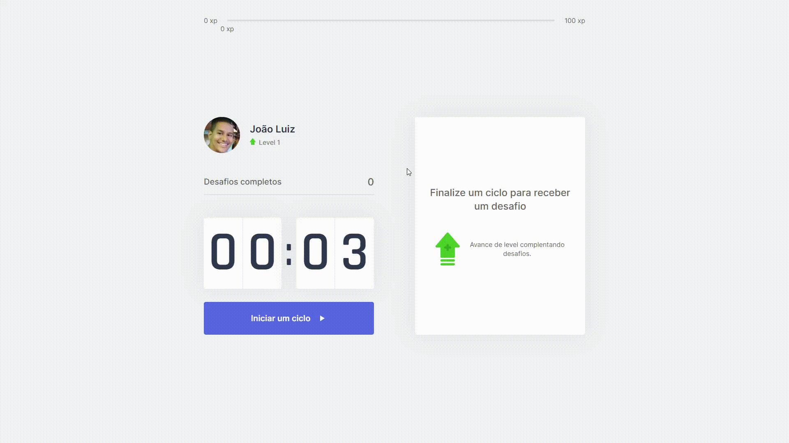

<p align="center">

</p>

App com coundtown de ciclos de 25 minutos, baseado na técnica pomodoro. Ao final de cada ciclo, é lançado um desafio para exercitar o corpo ou os olhos, com isso ganhando XP onde pode ganhar level e subir de ranking.

## **:computer: TECNOLOGIAS**

  - [NextJS](https://nextjs.org/)
  - [Typescript](https://www.typescriptlang.org/)
  - [Axios](https://github.com/axios/axios)
  - [MongoDB](https://www.mongodb.com/)
  - [Next-Auth](https://next-auth.js.org/)

## **:movie_camera: Preview**

#### Projeto desenvolvido durante a Next Level Week da [RocketSeat](https://rocketseat.com.br/), persistindo os dados apenas por cookies.




#
#### Projeto desenvolvido como desafio. Criada tela de login com OAuth do GitHub, adicionado conexão com mongoDB para salvar e persistir os dados, criada página de leaderboard com ranking dos 10 primeiros com maior level.
#


Demo: https://moveit-flammajl.vercel.app/

## Como utilizar

```bash
# Clone este repositório
$ git clone https://github.com/flammajl/move.it.git moveit

# Acesse a pasta do projeto no terminal/cmd
$ cd moveit

# Instale as dependências
$ yarn install | npm install

# Execute a aplicação em modo de desenvolvimento
$ yarn dev | npm run dev

# O servidor inciará na porta:3000 - acesse <http://localhost:3000>

# Projeto separado por branches, projeto desenvolvido durante a NLW4 branch (main), projeto com funcionalidades extras branch (milha-extra).

# Se Utilizar o projeto milha-extra, configurar também as variáveis de ambiente com Client ID e Client Secret do OAuth apps do GitHub e Cluster do MongoDB Atlas.
```
